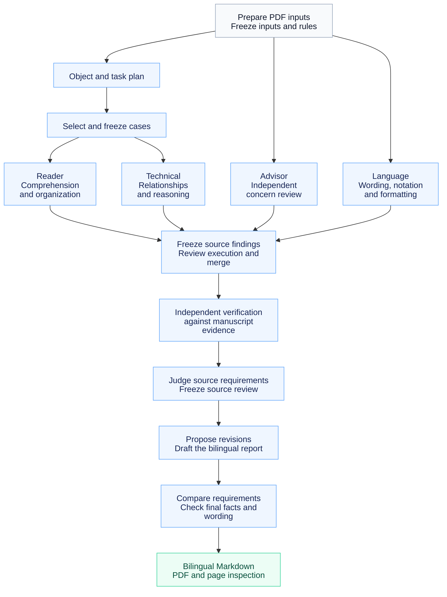

# MentorTrace

Version: [v1.1.0-dev](VERSION)

[English](README.md) | [简体中文](README.zh-CN.md)

Development status: the stable baseline is `v1.0.0`; ongoing work is on the `dev` branch. See [changes and migration notes](CHANGELOG.md) and the [development validation record](docs/validation-v1.1.0-dev.json). Other audit documents in `docs/` describe the v1.0.0 baseline. The development version is independently runnable, but improvements in diagnostic quality, live latency and usage have not been established by controlled comparisons.

MentorTrace derives judgment patterns from an academic supervisor's actual comments and successive manuscript revisions, and draws on published papers that supervisor considers well written to help authors identify problems in a new manuscript's argument, technical support, organization and expression. During review, it follows the manuscript's argument chains, technical relationships and revision cues, continually questioning whether explanations are sufficient, whether key steps are missing, and whether proposed revisions have factual and technical support. Each review comment identifies the relevant manuscript passage, explains the issue and its basis, and provides concrete revision suggestions. The results are organized into bilingual English–Chinese Markdown and PDF reports.

The current implementation runs as a **Codex skill with a Python workflow** and accepts **PDF manuscripts**. **LaTeX source input and output** are planned. It produces revision guidance and reports; automatically applying changes to the manuscript is not yet integrated.

## Contents

- [Quick start](#quick-start)
- [Usage prompt](#usage-prompt)
- [Review architecture](#review-architecture)
- [Report contents](#report-contents)
- [Repository structure](#repository-structure)
- [Corpus sources](#corpus-sources)
- [Dependencies and execution guide](#dependencies-and-execution-guide)
- [Privacy and license](#privacy-and-license)

## Quick start

Ask Codex to download the repository and prepare the environment:

```text
Download the complete dev branch of https://github.com/stevenyyzhang/MentorTrace locally, configure its required dependencies, check the environment, and tell me which repository directory to open in Codex. For the stable version, use the v1.0.0 release instead.
```

Once setup is ready, open the downloaded repository root in Codex, place your PDF in a local `workspaces/` directory, and use the review prompt below. See [Dependencies and execution guide](#dependencies-and-execution-guide) for dependencies and model access.

MentorTrace is a repository-scoped skill requiring the scripts and corpora in the complete repository. Its entry point is [`.agents/skills/mentortrace/SKILL.md`](.agents/skills/mentortrace/SKILL.md); see the [official Codex guide](https://learn.chatgpt.com/docs/build-skills) for installation and repository skill discovery.

## Usage prompt

Once the environment is ready, replace the filename and enter this one sentence in Codex:

```text
$mentortrace Review workspaces/manuscript.pdf and produce bilingual English–Chinese Markdown and PDF reports with concrete revision suggestions.
```

The skill provides the review rules, individual checks and report requirements. Outputs are saved locally under `runs/`. If a model connection or dependency is unavailable, unfinished steps must be identified.

## Review architecture

The workflow prepares the PDF, reviews it through four lanes, merges and verifies the findings, develops revision proposals, and delivers bilingual Markdown and PDF reports.



Arrows before review show the main input dependencies: object and task planning and case selection serve Reader and Technical only. Advisor starts independently from the full manuscript and its current batch of supervisor concerns.

| Module | Main inputs | Function |
| --- | --- | --- |
| Reader | Full manuscript, object and task plan, Reader cases | Check comprehension, argument flow and organization; identify explanatory gaps. |
| Technical | Full manuscript, object and task plan, Technical cases | Check technical relationships, assumptions, applicability and support for conclusions. |
| Advisor | Full manuscript, current batch of supervisor concerns | Independently check comprehension and technical issues using concerns distilled from historical revisions. |
| Language | Full manuscript, text units to inspect | Check language, notation, terminology consistency and formatting. |

Models perform all four review lanes. Historical concerns and paper cases guide the questions; every final finding still needs specific evidence from the new manuscript. In this development version, reviewers inspect actual initial execution after its freeze, adjudicate changed source requirements before comparing their final delivery, and review the final report facts, conditions and wording. Tools check source hashes, accounting and exact excerpts; they do not certify scientific correctness. These changes still need controlled manuscript replay. See the [execution guide](.agents/skills/mentortrace/references/execution.md) for details.

## Report contents

The final files are **`report_bilingual.md`** and **`report_bilingual.pdf`**. See the [fictional Markdown example](examples/report_bilingual.md) and [PDF example](examples/report_bilingual.pdf) for the report format.

| Report section | Contents |
| --- | --- |
| How to use this report | Manuscript information, actual model and reasoning effort, revision priorities and use notes |
| **Content and technical comments** | Problems in claims, explanations, assumptions, methods, derivations or experiments, with locations, judgment grounds and revision actions |
| **Organization and flow comments** | Suggestions on information selection, order, transitions and organization, with applicability conditions and tradeoffs |
| **Language and presentation comments** | Specific corrections to wording, grammar, terminology, notation or presentation |
| Coverage and remaining checks | Actual review coverage, unresolved questions and facts the author must confirm or supply |

The three comment categories have separate numbering. Each comment presents the English location, original passage, explanation and suggested revision before its Chinese explanation; the original passage appears once. Confirmed issues, items requiring confirmation and optional suggestions remain distinct.

Content and technical comments receive a revision priority when applicable: **High** affects the main argument, method comprehension or reproducibility and should be addressed first; **Medium** concerns a local explanation, definition or claim scope. Priority describes revision importance, rather than confidence that a defect exists. Ordinary language corrections need no priority label.

Suggestions may include concrete English sentences, complete paragraphs, or instructions to move, delete or add material. Missing derivations, experimental details or implementation facts are identified as author-supplied information. Supported drafts and drafts conditional on specific confirmations are distinguished. The PDF is generated from the same Markdown, with content-preservation and page-layout checks.

See [report-language.md](.agents/skills/mentortrace/references/report-language.md) and [delivery-preservation.md](.agents/skills/mentortrace/references/delivery-preservation.md) for the full rules.

## Repository structure

```text
MentorTrace/
├── README.md                       English project guide
├── README.zh-CN.md                 Chinese project guide
├── .agents/skills/mentortrace/
│   ├── SKILL.md                    Skill entry point
│   ├── agents/openai.yaml          Skill display metadata
│   ├── references/                 Review, evidence and delivery rules
│   ├── scripts/                    Preservation audit and report renderer
│   └── assets/                     Report stylesheet
├── scripts/
│   ├── mentortrace_v1.py           Workflow and response validation
│   ├── prepare_paper.py            PDF annotation removal and extraction
│   ├── goodpaper_runtime.py        Published-case selection and loading
│   ├── run_authorized_stage.py     Optional isolated model calls
│   ├── prepare_revision_proposals.py
│   ├── audit_public_release.py     Public-file and corpus checks
│   ├── doctor.py                   Local dependency checks
│   └── ...                        Other validation and transport tools
├── config/                        Project and optional model settings
├── corpus/
│   ├── advisor-concerns-v1/        Analysis of supervisor comments and revisions
│   └── published-cases-v1/         Published-paper cases, indexes and citations
├── examples/                      Fictional bilingual report examples
├── docs/                          Corpus fields, case checks and validation
├── tests/                         Offline workflow and public-package tests
├── requirements.txt
├── VERSION
├── LICENSE                        MIT for code, instructions and documentation
├── LICENSE-CORPUS.md               CC BY 4.0 for analytical corpora
└── THIRD_PARTY_NOTICES.md          Original-paper and dependency rights
```

`workspaces/` and `runs/` are created during local use and ignored by Git. They hold manuscripts, execution records and generated reports.

## Corpus sources

The corpora draw on two sets of manuscript materials:

**Papers from the research group revised by the supervisor.** The current source materials cover **18 papers**, each with multiple available annotated or revised versions. Actual comments, student responses and subsequent revisions inform the historical review concerns, judgment grounds, insufficient responses and applicability boundaries. These concerns cover both reader comprehension and technical arguments, such as concept explanations, information links, assumptions, derivations and supported claim scope. Their topics overlap with Reader and Technical, but Advisor uses them independently; they have no one-to-one mapping to published cases. Separate revision phases of the same paper count as one paper. Only anonymized, generalized analytical records are distributed; original manuscripts, verbatim comments and private revision histories are not publicly distributed. Learning here means consulting analytical records, not fine-tuning model parameters.

**Published papers the supervisor considers well written.** The current cases cover **52 papers**, primarily in wireless communications. Reader and Technical cases are developed from specific arguments and writing passages: Reader cases concern explanations, information arrangement and comprehension; Technical cases concern technical relationships, prerequisites, argument support and claim scope. Models produced the case analyses; these have not received item-by-item supervisor confirmation. Recommending a paper does not imply endorsing every case interpretation. Cases retain public bibliographic references. Original paper PDFs are not bundled.

Cases record source observations and analytical summaries, including relationships or approaches recurring across multiple papers. They do not establish strengths shared by every paper or automatically prove that one writing approach is better. Source facts, analyst interpretations and transfer judgments are distinguished; applicability must be checked against the new manuscript.

## Dependencies and execution guide

| Dependency | Purpose |
| --- | --- |
| Python 3.10+ and `requirements.txt` | Workflow, validation and document processing |
| Poppler: `pdftotext`, `pdftoppm` | PDF text and page extraction |
| Pandoc | Markdown to HTML |
| Chrome/Chromium or Edge | Local PDF generation |
| English and Chinese fonts | Bilingual typesetting |
| Authorized model access | Actual review; the optional CLI path also needs an available Codex CLI login |

Non-Python dependencies are installed separately. For ordinary use, prepare the environment above and invoke the skill. Stage commands, case selection, capacity checks and recovery instructions are documented in [execution.md](.agents/skills/mentortrace/references/execution.md).

If the skill is missing, check that the complete repository root is open. Repair unreadable text, equations or pages before review. If a model's capacity is insufficient, rearrange complete inputs rather than truncating necessary manuscript content or records.

## Privacy and license

Private manuscripts, original comments, marked passages, neighboring source text, identity mappings, private revision histories and local paper paths are excluded. Inputs, reports, logs and credentials remain local. Inspect actual files before publishing: Git ignore rules do not remove tracked content.

Code, skill instructions and documentation use [MIT](LICENSE). Original analytical records under `corpus/` use [CC BY 4.0](LICENSE-CORPUS.md); copying, modifying or redistributing them requires project attribution, source citations and change notices. Original paper rights remain with their rights holders; see [THIRD_PARTY_NOTICES.md](THIRD_PARTY_NOTICES.md).
