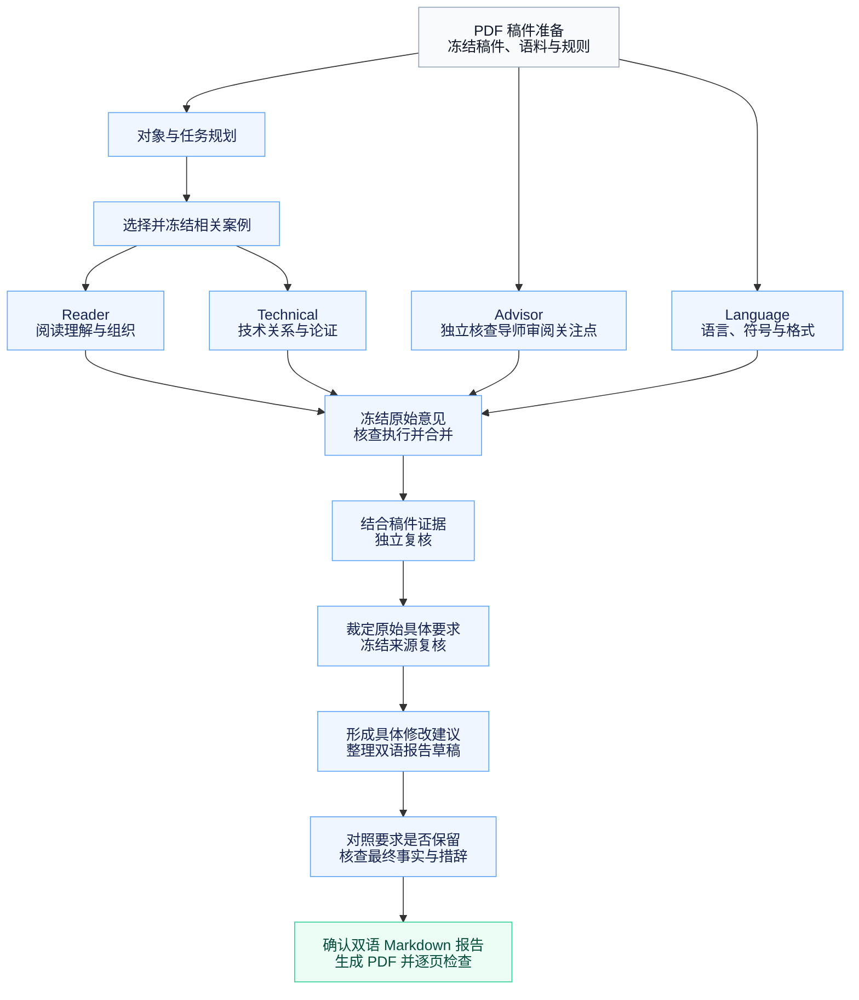

# MentorTrace

版本：[v1.1.0-dev](VERSION)

[English](README.md) | [简体中文](README.zh-CN.md)

开发状态：稳定基线为 `v1.0.0`，后续开发在 `dev` 分支进行。参见[变更与迁移说明](CHANGELOG.md)和[开发版验证记录](docs/validation-v1.1.0-dev.json)。`docs/` 中其他审核文档描述的是 v1.0.0 基线。开发版可独立运行，审阅质量、实际耗时和额度消耗的改进尚未通过受控对照验证。

MentorTrace 从真实学术导师的批注与多轮修改记录中提炼判断逻辑，并参考该导师认可的领域内已发表论文案例，帮助作者发现新稿中的论证、技术、组织和表达问题。审阅时，它沿着稿件中的论证链、技术关系和修改线索持续追问，核查解释是否充分、论证环节是否完整，以及修改建议是否有事实和技术依据。每条审阅意见均标明相关原文位置，说明问题及其判断依据，并给出具体修改建议，最终整理为中英双语 Markdown 与 PDF 报告。

当前以 **Codex skill + Python 工作流** 运行，支持 **PDF 格式的新论文稿件输入**，提供修改建议和报告。支持 **LaTeX 源码输入和输出** 是后续计划；自动将建议写回原稿尚未集成。

## 目录

- [快速开始](#快速开始)
- [使用提示词](#使用提示词)
- [运行架构](#运行架构)
- [最终报告包含什么](#最终报告包含什么)
- [项目文件夹结构](#项目文件夹结构)
- [语料来源](#语料来源)
- [依赖与详细执行指南](#依赖与详细执行指南)
- [隐私与许可证](#隐私与许可证)

## 快速开始

可以直接让 Codex 帮助下载并准备运行环境：

```text
请将 https://github.com/stevenyyzhang/MentorTrace 的 dev 分支完整下载到本地，配置 MentorTrace 所需依赖，检查运行环境，并告诉我应在 Codex 中打开哪个仓库目录。如需稳定版本，请改用 v1.0.0 Release。
```

准备完成后，在 Codex 中打开下载好的仓库根目录，将 PDF 稿件放入本地 `workspaces/` 文件夹，再使用下方的审阅提示词。所需依赖与模型访问见[依赖与详细执行指南](#依赖与详细执行指南)。

MentorTrace 是仓库级 skill，运行时需要完整仓库中的脚本和语料。入口为 [`.agents/skills/mentortrace/SKILL.md`](.agents/skills/mentortrace/SKILL.md)；安装与仓库 skill 的发现规则见 [Codex 官方说明](https://learn.chatgpt.com/docs/build-skills)。

## 使用提示词

环境准备好后，将文件名替换为自己的 PDF，在 Codex 中输入这一句：

```text
$mentortrace 请审阅 workspaces/manuscript.pdf，并生成包含具体修改建议的中英双语 Markdown 和 PDF 报告。
```

审阅规则、各路检查及报告要求由 skill 负责；输出保存在本地 `runs/` 下。模型或依赖不可用时，应说明未完成的步骤。

## 运行架构

从 PDF 稿件准备开始，经过四路审阅、合并复核和修改建议整理，最终交付中英双语 Markdown 与 PDF 报告。



审阅前的箭头表示主要输入依赖：对象与任务规划、案例选择只服务于 Reader 和 Technical；Advisor 直接使用完整稿件和本批导师审阅关注点，独立开始审阅。

| 模块 | 主要输入 | 功能 |
| --- | --- | --- |
| Reader | 完整稿件、对象与任务规划、Reader 案例 | 检查读者能否理解论证、信息顺序和论文组织，指出解释缺口。 |
| Technical | 完整稿件、对象与任务规划、Technical 案例 | 检查技术关系、假设、适用条件及结论是否得到论证支持。 |
| Advisor | 完整稿件、本批导师审阅关注点 | 从历史修改提炼的关注点出发，独立检查阅读理解和技术问题。 |
| Language | 完整稿件、待检查的文本单元 | 检查语言、符号、术语一致性与格式问题。 |

四路审阅均由模型执行。历史关注点与论文案例提供判断线索，每条最终意见仍须有新稿中的具体证据；此开发版在初始结果冻结后核查实际执行，先裁定有变化的原始具体要求，再对照最终交付，并核查报告事实、条件和措辞。工具验证来源哈希、对应记录和摘录，不能证明科学判断正确；改进效果仍需受控稿件回放。详细执行说明见 [运行指南](.agents/skills/mentortrace/references/execution.md)。

## 最终报告包含什么

最终文件为 **`report_bilingual.md`** 和 **`report_bilingual.pdf`**。可查看[虚构 Markdown 示例](examples/report_bilingual.md)与 [PDF 示例](examples/report_bilingual.pdf)，了解报告格式。

| 报告部分 | 内容 |
| --- | --- |
| 使用说明 | 稿件信息、实际模型与推理强度、修改优先级和使用提示 |
| **内容与技术意见** | 主张、解释、假设、方法、推导或实验中的问题，以及位置、判断依据和修改动作 |
| **篇章与行文意见** | 信息取舍、顺序、过渡和组织建议，说明适用条件及可能的取舍 |
| **语言与格式意见** | 具体措辞、语法、术语、符号或表达格式的修改 |
| 覆盖范围与待核对事项 | 实际检查范围、未解决问题和需要作者确认或补充的信息 |

三类意见分别编号。每条意见先给出英文位置、原文、审阅意见和建议修改，再给出中文解释；稿件原文展示一次。确认的问题、需要核对的事项和可选建议分别说明。

内容与技术问题适用时标注修改优先级：**高**表示影响主要论证、方法理解或可复现性，应优先处理；**中**表示局部解释、定义或结论范围需要改善。优先级表示修改的重要性，不能替代对问题是否成立的判断；普通语言修正无需标注优先级。

修改建议可包括具体英文句子、完整段落或移动、删除、补充等操作。缺少推导、实验或实现事实时，明确列出作者需要补充什么；已有事实支持的草稿与需要确认前提的条件稿分别标明。PDF 从同一份 Markdown 生成，并检查内容保留和逐页排版。

详细规范见 [report-language.md](.agents/skills/mentortrace/references/report-language.md) 和 [delivery-preservation.md](.agents/skills/mentortrace/references/delivery-preservation.md)。

## 项目文件夹结构

```text
MentorTrace/
├── README.md                       英文项目说明
├── README.zh-CN.md                 中文项目说明
├── .agents/skills/mentortrace/
│   ├── SKILL.md                    skill 入口
│   ├── agents/openai.yaml          skill 展示信息
│   ├── references/                 审阅、证据与交付规则
│   ├── scripts/                    内容保留审计和报告生成器
│   └── assets/                     报告样式表
├── scripts/
│   ├── mentortrace_v1.py           工作流和响应验证
│   ├── prepare_paper.py            PDF 去批注及页面提取
│   ├── goodpaper_runtime.py        已发表论文案例选择与加载
│   ├── run_authorized_stage.py     可选的隔离模型调用
│   ├── prepare_revision_proposals.py
│   ├── audit_public_release.py     公开文件和语料检查
│   ├── doctor.py                   本地依赖检查
│   └── ...                        其他验证和传输工具
├── config/                        项目与可选模型服务设置
├── corpus/
│   ├── advisor-concerns-v1/        导师审阅关注点及其判断依据
│   └── published-cases-v1/         已发表论文案例、索引与引用
├── examples/                      虚构双语报告示例
├── docs/                          语料字段、案例核查与验证说明
├── tests/                         离线工作流和公开包测试
├── requirements.txt
├── VERSION
├── LICENSE                        代码、指令与文档的 MIT 许可
├── LICENSE-CORPUS.md               分析语料的 CC BY 4.0 许可
└── THIRD_PARTY_NOTICES.md          原论文及依赖的权利说明
```

`workspaces/` 与 `runs/` 在本地使用时创建，由 Git 忽略，用于保存稿件、运行记录与生成报告。

## 语料来源

语料来自以下两类论文材料：

**导师修改过的课题组内论文。** 当前分析材料涉及 **18 篇论文**，每篇均有多个可用的批注或修订版本。结合导师真实批注、学生回应和后续修改，提炼“导师审阅关注点”（concerns）及其判断依据、仍不充分的回应和适用边界。关注点同时涉及阅读理解和技术论证，例如概念解释、信息衔接、假设、推导及结论支持范围；它们与 Reader、Technical 的检查主题有交集，运行时由 Advisor 独立使用，不与案例库建立一一对应。同一论文的不同修改阶段合并计为一篇。公开仓库只分发经过匿名化和概括的分析记录，原始稿件、批注原文及私人修改历史未公开。这里的“学习”通过分析语料供模型参考实现，不是模型参数微调。

**导师认为写得较好的领域内已发表论文。** 当前案例来源覆盖 **52 篇论文**，主要属于无线通信领域。从这些论文的具体论证与写作片段中整理 Reader 和 Technical 案例：Reader 关注概念解释、信息安排与读者理解；Technical 关注技术关系、前提、论证支持和适用范围。案例分析由模型完成，未逐条取得导师确认；导师推荐论文本身，不代表其认可案例中的每条分析。案例保留公开文献引用，仓库不附原论文 PDF。

案例是可核对的原文观察与分析总结，包含在多篇论文中出现的关系或处理方式；它们不等于所有论文共有的优势，也不能自动证明某种写法更好。原文事实、分析者解释和迁移到新稿的判断分别标注，实际适用性仍需结合新稿检查。

## 依赖与详细执行指南

| 依赖 | 用途 |
| --- | --- |
| Python 3.10+ 和 `requirements.txt` | 工作流、验证与文档处理 |
| Poppler：`pdftotext`、`pdftoppm` | PDF 文本与页面提取 |
| Pandoc | Markdown 转 HTML |
| Chrome/Chromium 或 Edge | 本地生成 PDF |
| 中英文字体 | 双语排版 |
| 获授权的模型访问 | 实际审阅；可选 CLI 方式还需可用的 Codex CLI 登录 |

非 Python 依赖需单独安装。普通使用按上面的安装步骤准备环境，再调用 skill 即可；逐阶段命令、案例选择、容量检查和失败后继续运行的方法，放在 [execution.md](.agents/skills/mentortrace/references/execution.md) 中。

如果看不到 skill，检查是否打开了完整仓库根目录。如果文本、公式或页面无法读取，应先修复输入；如果模型容量不足，应重新安排完整输入，而不是截断必要的稿件或语料。

## 隐私与许可证

私人稿件、原批注、标记段落、相邻原文、身份映射、私人修改历史和本机论文路径不上传。使用时的输入、报告、日志与凭据保存在本地；发布前仍需检查实际文件，Git 忽略规则不会移除已跟踪内容。

代码、skill 指令和文档使用 [MIT](LICENSE)。`corpus/` 中的原创分析记录使用 [CC BY 4.0](LICENSE-CORPUS.md)，复制、修改或再分发时保留项目署名、来源引用和修改说明。原论文权利仍属于其权利人，见 [THIRD_PARTY_NOTICES.md](THIRD_PARTY_NOTICES.md)。
